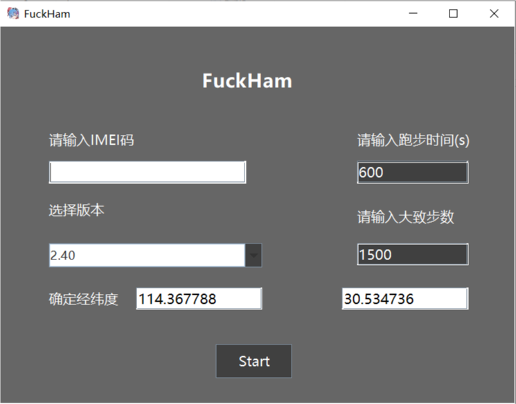
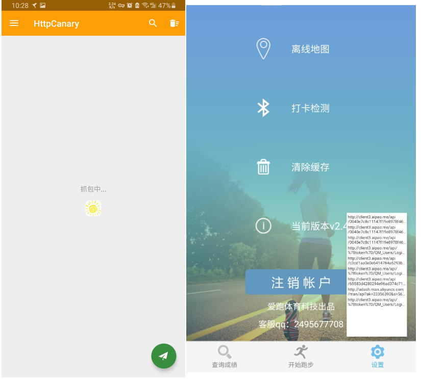
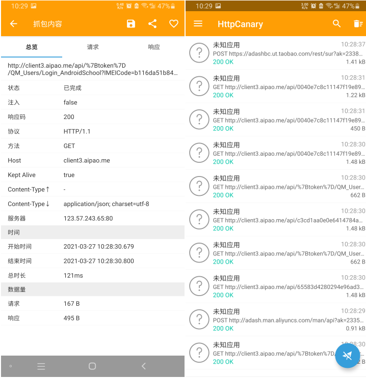
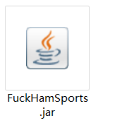
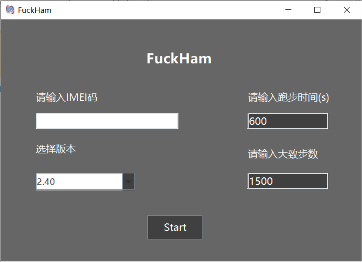
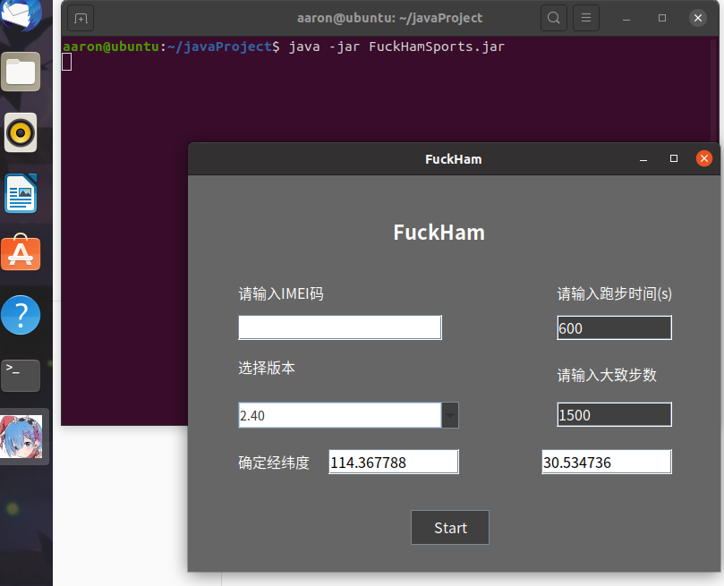
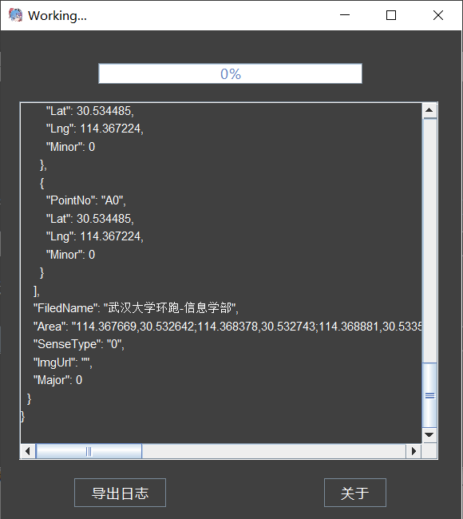
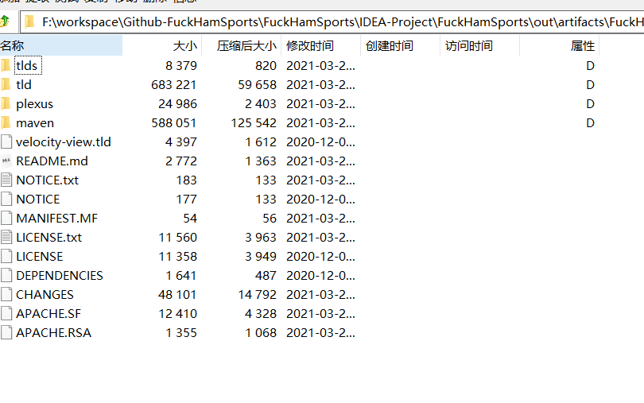
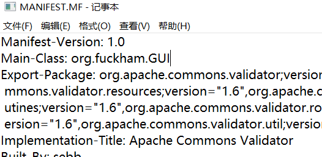

# FuckHamSports
        

WHU-汉姆-阳光体育代跑图形界面工具-环境打包-即开即用

参考项目：https://github.com/S-Ex1t/SunnyRunningPy


**项目jar文件：**仓库不再存放二进制可执行jar文件，请前往https://github.com/Waldenth/FuckHamSports/releases，选择对应版本的jar下载获取

网盘备份：https://share.weiyun.com/fcFMpOXu


### Update

#### v0.1.3

修复日志导出文件选择框逻辑，加入界面锁，过滤所有输入框空格

#### v0.1.2

修改异常处理机制，删除部分冗余

#### v0.1.1

添加了简单的设置经纬度的界面



以经度114.367788，纬度30.534736为例，


可以定位其为武汉大学信息学部田径场，如果需要在其他地方进行测试，请自行查询经纬度并进行设置。如果执行日志界面请求数据显示为空，请检查经纬度是否满足要求。如果正确执行，`WorkingFrame`界面应该能够看到请求到的位置`json`数据


## For users

1. 首先，需要您自行获取您的IMEI码，这是您的身份识别码

**For Android:** 您可以使用Packet Capture或者HttpCanary(黄鸟)进行抓包，安装好app后，请根据app提示安装证书,在进行抓包前请确认已经关闭阳光体育App.   

以HttpCanary(黄鸟)为例：

​		1.1打开HttpCanary, 进入设置->目标应用->选择阳光体育服务平台(com.aipao.hanmoveschool)


​		1.2 回退到主界面，点击右下角纸飞机按钮，开始抓包



​		1.3 关闭跑步App，返回HttpCanary，寻找带有`%7Btoken%7D`的请求接口，打开详情，找到字段`IMEIcode=.....`



​		1.4 复制IMEIcode字段, （去掉前缀`IMEIcode=`）

**For IOS:** 据称IOS断网打开APP报错，提示框中会有IMEI

​	

2. 为使用FuckHamSports GUI程序，您需要下载jre/jdk 14或者更高版本。这是本java程序执行所依赖且唯一依赖的组件。支持Windows/Linux/MacOS等PC操作系统

   jre下载地址：https://www.java.com/en/download/manual.jsp

   jdk下载地址 ：https://www.oracle.com/java/technologies/javase-downloads.html

   

3.  确认第1、2步完成后，请使用jdk/jre为打开方式，双击运行FuckHamSports.jar



4. 如果运行成功，您应该能够看到类似如下的界面

   Windows10:



​	  Ubuntu 20.04.1:

​                 


​	   如果未能成功运行，请检测第2步是否成功完成，或根据保存信息网络查询以及向本项目提交`issue`

5.  输入第1步获取的IMEI码，设置好版本(目前最低版本不能低于2.40)、您所希望的大概跑步时间(以秒作为单位)、大致步数。点击`Start`按钮，您应该弹出如下界面



6. 请耐心等待进度条完成至100%，并查看日志窗口最后的信息，如果是`success`，您应当已经完成了一次跑步。如果是失败或其他信息，请根据日志信息查询原因或提交`issue`

## For developers

本项目IDE 是IntelliJ IDEA version 2020.2.3，使用`apache-maven-3.6.3`管理依赖


依赖第三方包为:

```xml
 <dependencies>
    <dependency>
      <groupId>junit</groupId>
      <artifactId>junit</artifactId>
      <version>4.11</version>
      <scope>test</scope>
    </dependency>
    <dependency>
      <groupId>org.apache.maven.plugins</groupId>
      <artifactId>maven-project-info-reports-plugin</artifactId>
      <version>3.0.0</version>
      <type>maven-plugin</type>
    </dependency>

    <dependency>
      <groupId>org.apache.maven.plugins</groupId>
      <artifactId>maven-project-info-reports-plugin</artifactId>
      <version>3.0.0</version>
    </dependency>

    <!-- https://mvnrepository.com/artifact/org.apache.httpcomponents/httpclient -->
    <dependency>
      <groupId>org.apache.httpcomponents</groupId>
      <artifactId>httpclient</artifactId>
      <version>4.5.6</version>
    </dependency>

    <!-- https://mvnrepository.com/artifact/org.json/json -->
    <dependency>
      <groupId>org.json</groupId>
      <artifactId>json</artifactId>
      <version>20201115</version>
    </dependency>
  </dependencies>
```

### 源代码文件

- `RunFuck.java:`核心代码文件，提供了提交跑步资料并请求相关信息的类，其中`run(String imeiCode,String version)`为完全体功能函数（静态方法），用于快速测试模块是否能够正常工作，GUI组件则使用拆分的`login(String aimeiCode,String aversion);  getUserInfo() ; getRunInfo(int seconds,int steps) ; getEndRunningInfo()`静态方法
- `MainFrame.java:` 使用`java swing`编写的GUI主界面，用于获取输入
- `WorkingFrame.java:` 跑步过程中的信息界面，用于绘制进度条和显示当前的请求日志信息。**注意，本界面只有带参数的构造方法`public WorkingFrame(String imeiCode,String version,String seconds,String steps ....)`；并且构造方法最后会直接调用跑步执行体自动开始代跑**
- `AboutFrame.java:` 其他信息界面
- `GUI.java:`程序主入口点，绘制一个`MainFrame`

### 编译

项目使用jdk14进行打包，为保证编译通过，请使用jdk14或者更高版本

#### Attention

- 请不要随意更改项目的**编译器版本和设置**，可能造成(**has verified**) 项目的第三方依赖包和编译版本之间不匹配导致生成的jar无法执行的问题.
- 如果存在**JNI error**: 使用压缩包管理工具(如7-Zip)打开jar包，进入META-INF目录下，删除第三方包生成的`.SF,.RSA`文件.



- 如果存在**找不到主类的问题**: 向jar包的MANIFEST.MF文件添加`Main-Class: org.fuckham.GUI`.




## 适用范围

本项目理应支持所有**阳光体育服务平台**打卡，包括但不限于：

```
【1】武汉大学
【2】武汉工程大学
【3】安徽师范大学
【4】安徽国防科技职业学院
【5】南京科技职业学院
【6】南京晓庄学院
【7】南通师范高等专科学校
【8】南昌大学
【9】南昌航空大学
【10】宁夏大学
【11】南京工程学院
【12】井冈山大学
【13】山西大学商务学院
【14】武汉纺织大学
【15】扬州大学
【16】江南大学
【17】南京农业大学
【18】成都工业学院
【19】保定电力职业技术学院
【20】包头医学院
【21】内蒙古医科大学
【22】安徽财贸职业学院
【23】南京工业大学
【24】辽宁工程技术大学
【25】南京旅游职业学院
【26】黎明职业大学
【27】丽水学院
【28】新华学院
【29】铜川职业技术学院
【30】太原学院
【31】厦门大学
【32】江西师范大学科学技术学院
【33】宁夏医科大
【34】内蒙古医科大学
```

### 注意

本项目预配置坐标信息为**武汉大学信息学部**，如在其他学校需要使用，v-0.1.0版本需要进入RunFuck.java将`/QM_Runs/SRS?S1=30.534736&S2=114.367788&S3="`url信息替换成本校对应场地位置。后续会视情况添加该配置的图形接口


## License

本项目核心参考于https://github.com/S-Ex1t/SunnyRunningPy

项目遵守GPL3.0免费开源协议.


## 本项目仅供研究，使用者造成的任何后果由其自行承担。